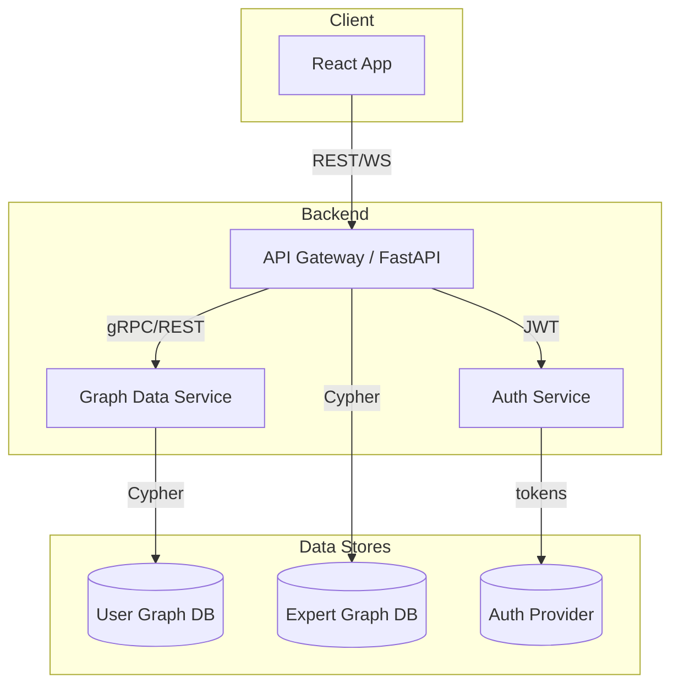

# User-Specific Graph Database Feature – Implementation Roadmap

## 1. Objectives
- Allow each authenticated user (or workspace) to persist and evolve their **Business Knowledge Graph** inside the application.
- Keep the feature optional for anonymous users; enable it once a user opts-in and authenticates.
- Maintain clear separation from the existing **Expert Mental Model** graph while enabling cross-graph insights in the future.

## 2. High-Level Architecture Overview

* Logical, not physical: components may run in the same container initially.

## 3. Phased Plan
| Phase | Goals | Key Tasks | Deliverables |
|-------|-------|-----------|--------------|
| 0. Discovery & PoC | Validate tech choices | • Spike Supabase Auth<br>• Spike Neo4j & Zep APIs<br>• Data-model PoC | PoC repo branch, decision doc |
| 1. Auth Foundation | Optional login flow | • Integrate Supabase Auth SDK in UI<br>• Issue & validate JWT in FastAPI<br>• RBAC skeleton | Users can sign up/sign in |
| 2. Data-Store Setup | Multi-tenant graph store | • Provision chosen graph DB (Neo4j Aura, self-host, or Zep)<br>• Define tenant isolation strategy (DB-per-user vs. label filter)<br>• IaC scripts/docker-compose updates | Running DB instance |
| 3. Service Layer | API for CRUD graph ops | • `GraphDataService` FastAPI router<br>• CRUD endpoints + validation<br>• Basic Cypher queries or Zep SDK<br>• Unit tests | `/api/user-graph/*` endpoints |
| 4. Frontend Integration | User graph UI | • Add UI toggles for “My Business Graph”<br>• Reuse existing GraphView with user data<br>• Handle anonymous vs. logged-in states | Interactive user graph |
| 5. Observability & Ops | Prod-ready | • Metrics & tracing<br>• Backups / export<br>• Cost monitoring | Dashboards, runbooks |

## 4. Key Decisions & Rationale
1. **Auth Provider – Supabase vs. Auth0**
   - Supabase aligns with existing Postgres stack, generous free tier.
   - Provides user management, social logins, and row-level security if we extend to Postgres.
2. **Graph Store Options**
   | Option | Pros | Cons |
   |--------|------|------|
   | Separate Neo4j cluster | Familiar tech, rich Cypher, local dev parity | Extra infra, multi-tenant complexity |
   | Zep (vector + graph) | Managed, automatic embedding storage, user context features | New dependency, pricing, less Cypher-power |
   | Mixed: Neo4j per user theme, Zep for long-term memory | Best-of-breed for different use-cases | Higher complexity, two bills |
3. **Tenant Isolation**
   - Start with **label-based segregation** (`(:UserGraph {user_id})`) for speed.
   - Move to **DB-per-tenant** or **Aura DS cluster-per-tenant** if scale demands.

## 5. Risks & Mitigations
- **Data privacy** → Field-level encryption & auth middleware.
- **Cost creep** → Implement soft limits on graph size per user.
- **Schema drift** → Versioned migrations using Liquibase-like tooling for Cypher.

## 6. Rough Timeline
| Week | Milestone |
|------|-----------|
| 1-2 | Phase 0 complete, tech decision PR merged |
| 3-4 | Auth foundation live on staging |
| 5-6 | Graph DB provisioned & service layer alpha |
| 7-8 | Frontend integration beta |
| 9 | Observability & docs |

## 7. Open Questions
- Do we require real-time collaboration across multiple users within a workspace?
- Expected upper bounds on nodes/edges per user?
- Will we eventually expose user data to LLMs for personalized answers?

## 8. Chat History & User Memory
Modern knowledge-centric apps benefit from persisting **chat transcripts** so that retrieval-augmented prompting can leverage prior context.  If we adopt Zep, it naturally stores time-ordered message history alongside vector embeddings.

### Relevance
- **User Experience** – Recall past conversations, reduce repeat questions.
- **Personalization** – Enable LLM to tailor suggestions based on prior business details.
- **Analytics** – Surface insights on user pain-points over time.

### Architectural Placement
```mermaid
graph TD;
  subgraph Backend
    B[API Gateway]
    D[Graph Data Service]
    M[Chat Memory Service (Zep)]
  end
  B -- "/chat*" --> M
  B -- "/user-graph*" --> D
```
* `Chat Memory Service` can be a thin wrapper around the Zep SDK; messages are stored and retrieved by `user_id`.

### Storage Strategy: Dual-Write
To satisfy **both** system recall and a user-facing conversation log:
1. **Supabase Postgres** – Authoritative store for raw chat data (`chat_messages` table).
   - Columns: `id`, `user_id`, `role`, `content`, `created_at`, `metadata` (JSONB).
   - Indexed on `(user_id, created_at)` for efficient pagination.
2. **Zep** – Secondary store for vector-searchable memory (`message_id`, `user_id`, embedding).

> On every message:
> • Write row to Supabase inside the main request transaction.
> • Fire-and-forget enqueue to Zep (retry queue) so LLM recall remains decoupled.

### UI Implications
- Add a **“Conversation History”** page that queries Supabase via the existing auth token.
- Allow users to delete messages → cascades to Supabase AND triggers delete in Zep.

### Phased Plan – Additions
| Phase | Additional Task |
|-------|-----------------|
| 2 | Create `chat_messages` schema & Supabase RLS policies |
| 4 | Build Conversation History UI (list + delete) |

### Complexity vs. Benefit (updated)
| Aspect | Complexity | Benefit |
|--------|-----------|---------|
| Dual-write Supabase + Zep | Medium | High – user browsing + semantic recall |
| Supabase only | Low | Medium – no semantic search |
| Zep only | Low | Medium – recall, but no user log |

The above tasks are incremental and do **not** alter the core graph-storage work; they simply branch off the same auth token and user-id metadata.

---
**Next Action:** Merge this roadmap, then begin Phase 0 spikes. 